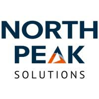
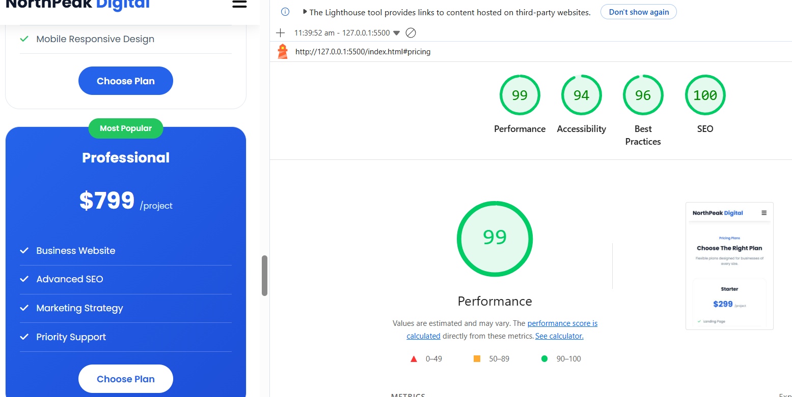
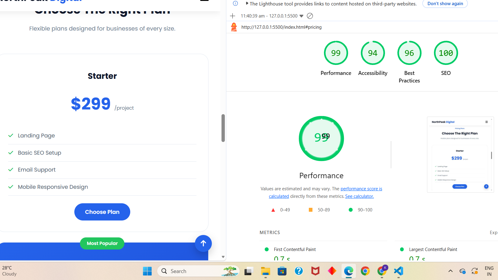

# 🚀 NorthPeak Digital

A modern, responsive one-page agency website created for **NorthPeak Digital**, a fictional digital growth agency.

The project focuses on:

- Professional UI/UX design
- Responsive layouts
- Accessibility
- Performance optimization
- Clean semantic code
- Client-side form validation

This project was built without using any website builders such as:

- WordPress
- Wix
- Webflow

---

# 📌 Project Information

## Project Name

NorthPeak Digital Agency Website

## Project Type

One-page responsive agency landing page

## Purpose

The goal of this project is to create a realistic agency website that demonstrates:

- Frontend development skills
- Responsive design ability
- UI implementation
- Form validation
- Performance optimization

---

# 🌐 Live Website

Add deployed URL:
https://n-digitaldemo.netlify.app/

---

# 📂 Repository

GitHub Repository:
https://github.com/kb-patel2005/north-pek

---

# ✨ Features

## 🏠 Hero Section

The hero section includes:

- Strong marketing headline
- Agency introduction
- Call-to-action buttons
- Modern visual design
- Responsive image layout

Features:

✔ Clear value proposition  
✔ Conversion-focused CTA  
✔ Mobile optimized layout  

---

# 💼 Services Section

NorthPeak Digital provides six main services:

## 1. Web Development

Building modern websites using:

- HTML
- CSS
- JavaScript
- Modern frontend practices

## 2. SEO Optimization

Improving:

- Search visibility
- Website ranking
- Organic traffic

## 3. Digital Marketing

Includes:

- Campaign planning
- Lead generation
- Online growth strategies

## 4. Brand Design

Creating:

- Visual identity
- Brand consistency
- Customer-focused designs

## 5. Analytics

Tracking:

- User behavior
- Website performance
- Business growth

## 6. App Development

Creating:

- Responsive applications
- Mobile-friendly experiences

---

# 📊 Results Section

The results section displays:

- Company achievements
- Client satisfaction
- Project statistics
- Customer testimonial

---

# 💬 Testimonials

The testimonial section builds trust by showing:

- Customer feedback
- Client information
- Professional experience

Example:

> NorthPeak Digital completely transformed our online presence and helped us generate more customers.

---

# 💰 Pricing Section

The pricing section contains three plans.

## Starter Plan

Suitable for:

- Small businesses
- Landing pages
- Basic online presence

Includes:

- Landing Page
- Basic SEO
- Email Support
- Responsive Design

---

## Professional Plan

Recommended plan.

Includes:

- Business Website
- Advanced SEO
- Marketing Strategy
- Priority Support

Features:

- Highlighted card design
- Popular badge
- Better conversion focus

---

## Enterprise Plan

For large organizations.

Includes:

- Unlimited Pages
- Dedicated Manager
- Advanced Analytics
- Custom Solutions

---

# 📞 Contact Section

The contact section contains:

## Contact Information

Includes:

- Address
- Email
- Phone number
- Social media links

## Contact Form

Fields:

- Name
- Email
- Phone
- Message

Validation:

✔ Required name validation  
✔ Email format validation  
✔ Phone validation  
✔ Message length validation  

---

# 🛠️ Technologies Used

## Frontend Technologies

| Technology | Purpose |
|---|---|
| HTML5 | Website structure |
| CSS3 | Styling and responsiveness |
| JavaScript | Interactions and validation |

---

# External Resources

## Icons

Font Awesome

## Fonts

Google Fonts

# 📊 Lighthouse Reports

## Mobile Lighthouse Report

## Desktop Lighthouse Report

"# north-pek" 
